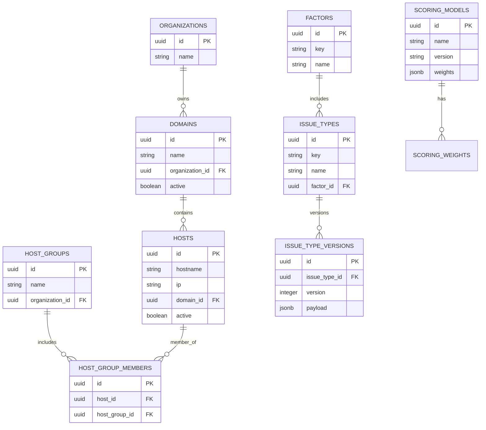

# Database Design

This document describes the initial database design and includes an ERD.

Mermaid ERD:

```mermaid
erDiagram
    ORGANIZATIONS ||--o{ DOMAINS : owns
    DOMAINS ||--o{ HOSTS : contains
    HOST_GROUPS ||--o{ HOST_GROUP_MEMBERS : includes
    HOSTS ||--o{ HOST_GROUP_MEMBERS : member_of

    FACTORS ||--o{ ISSUE_TYPES : includes
    ISSUE_TYPES ||--o{ ISSUE_TYPE_VERSIONS : versions

    SCORING_MODELS ||--o{ SCORING_WEIGHTS : has

    ORGANIZATIONS {
        uuid id PK
        string name
    }
    DOMAINS {
        uuid id PK
        string name
        uuid organization_id FK
        boolean active
    }
    HOSTS {
        uuid id PK
        string hostname
        string ip
        uuid domain_id FK
        boolean active
    }
    HOST_GROUPS {
        uuid id PK
        string name
        uuid organization_id FK
    }
    HOST_GROUP_MEMBERS {
        uuid id PK
        uuid host_id FK
        uuid host_group_id FK
    }
    FACTORS {
        uuid id PK
        string key
        string name
    }
    ISSUE_TYPES {
        uuid id PK
        string key
        string name
        uuid factor_id FK
    }
    ISSUE_TYPE_VERSIONS {
        uuid id PK
        uuid issue_type_id FK
        integer version
        jsonb payload
    }
    SCORING_MODELS {
        uuid id PK
        string name
        string version
        jsonb weights
    }
```
